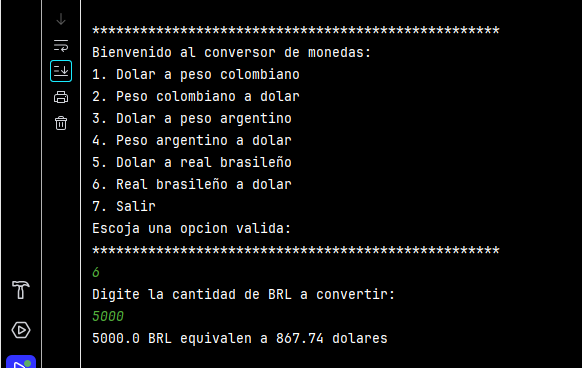

# Conversor de Monedas

Este proyecto en Java es un conversor simple de monedas que permite convertir entre dólar estadounidense (USD) y varias monedas locales como el peso colombiano (COP), peso argentino (ARS) y real brasileño (BRL).

## Funcionalidades

- Convertir de dólar a:
    - Peso colombiano
    - Peso argentino
    - Real brasileño
- Convertir de monedas locales a dólar.
- Utiliza un menú de opciones para seleccionar la conversión deseada y solicitar la cantidad a convertir.
- Calcula el valor convertido en función de la tasa de cambio y redondea el resultado a dos decimales.

## Cómo usar

1. Al iniciar, se presenta un menú con opciones de conversión.
2. Ingrese el número correspondiente a la opción de conversión deseada.
3. Ingrese la cantidad a convertir cuando se le solicite.
4. Verá el resultado de la conversión en pantalla.

Para salir, seleccione la opción **Salir**.

## Requisitos

- Java 11 o superior.

